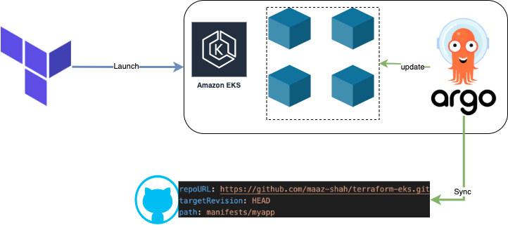

# Terraform Launch configuration for EKS
Launch EKS cluster using terraform and Install [ArgoCD](https://argo-cd.readthedocs.io/en/stable/) Deployment tool for continous deployment.

In this example I have used a sample pyhton application that enumerates the object in object storage [python-enumerate-api](https://github.com/maaz-shah/python-enumerate-api)

> Creation of Object storage and upload can be found here [terraform-object-storage](https://github.com/maaz-shah/terraform-object-storage)

The application pipeline builds and upload the container to [docker hub](https://hub.docker.com/repository/docker/mazishah/python-enumrate-api) 

This example will demonstrate how we can launch AWS EKS cluster and implement continous deploy using gitops techniques.

## Define Access key and Secret key for AWS to launch cluster
```
export TF_VAR_access_key=XXXXXX
export TF_VAR_secret_key=XXXXX
```
update region and bucket name for the sample app in `variables.tf` and execute
```
terraform plan && terraform apply
```

>ArgoCD is pointed to read yaml files inside manifests/myapp

>As a pre requisite of the sample application this configuration creates a secret that is needed for application to run.



## FAQ
1. Error creating Cluster
```
Error: error creating EKS Cluster (my-cluster): UnsupportedAvailabilityZoneException: Cannot create cluster 'my-cluster' because us-west-1b, the targeted availability zone, does not currently have sufficient capacity to support the cluster. Retry and choose from these availability zones: us-west-1a, us-west-1c
```
This happens when AWS does not have enough resources to launch the cluster in the specific zone, you can exclude zone in `data.tf` 
```
exclude_names = ["us-east-1e", "us-west-1b"]
```